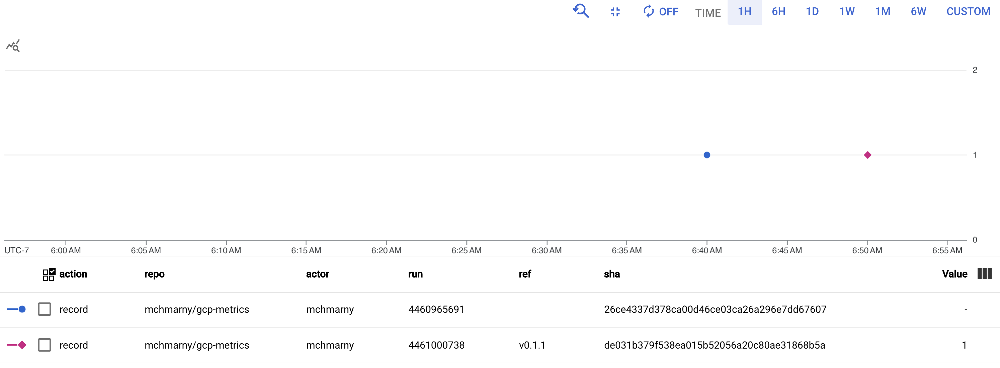

# gcp-metrics

GitHub Actions action to create custom time-series metrics in Google Cloud.

> This action requires Google Cloud credentials that are authorized to access the secrets being requested. See [workload identity](#workload-identity) section for more information.

## usage

To use this action in your GitHub Actions workflow: 

> Complete working example is available in [.github/workflows/meter.yaml](.github/workflows/meter.yaml).

```yaml
- id: meter
  name: Record Metric
  uses: mchmarny/gcp-metrics@main  # pin this to the latest release (e.g. v0.1.0)
  with:
    project: my-project-id
    metric: image-build
    value: 1

- name: Print Output
  run: |
    echo "metric: ${{ steps.meter.outputs.metric }}"
    echo "value: ${{ steps.meter.outputs.value }}"
```

The resulting custom metric in GCP Metrics Explorer would look something like this:



> Hopefully your metrics are more than just the single point in this example. 

## inputs

The `mchmarny/gcp-metrics` workflow requires the following input parameters:

* `project`: (Required) ID of the GCP project where you want to these metrics to be recorded.
* `metric`: (Required) Name of the metrics you want to create (e.g. `build-count`).
* `value`: (Required) Numeric value you want to record for the above `metric` (e.g. `1`).

## workload identity 

GCP Workload Identity enables keyless authentication from GitHub Actions to GCP. No GCP service account keys and GCP secrets required. You can follow the instructions on how to set it up in your project [here](https://cloud.google.com/blog/products/identity-security/enabling-keyless-authentication-from-github-actions), or you can use the Terraform setup in this repo to automate the entire process.

#### terraform setup
  
To deploy Workload Identity into your GCP project, first, close this repo:

```shell
git@github.com:mchmarny/gcp-metrics.git
```

Next, navigate to the `setup` directory inside of that cloned repo:

```shell
cd setup
```

Authenticate to GCP:

```shell
gcloud auth application-default login
```

Initialize Terraform: 

```shell
terraform init
```

When done, apply the Terraform configuration:

```shell
terraform apply
```

When promoted, provide requested variables:

* `project_id` is the GCP project ID (not the name)
* `git_repo` qualified name of the newly cloned repo (e.g. `your-github-username/your-repo-name`)

When completed, this will output the configured resource information looking something like this:

```shell
PROVIDER_ID = "projects/12345678/locations/global/workloadIdentityPools/metrics-github-pool/providers/github-provider"
SA_EMAIL = "metrics-github-actions-user@PROJECT_ID.iam.gserviceaccount.com"
```

Paste the output values into the `google-github-actions/auth` parameters:

```yaml
- uses: google-github-actions/auth@v1
  with:
    workload_identity_provider: <PROVIDER_ID>
    service_account: <SA_EMAIL>
```

> Working example available in [.github/workflows/meter.yaml](.github/workflows/meter.yaml).

## disclaimer

This is my personal project and it does not represent my employer. While I do my best to ensure that everything works, I take no responsibility for issues caused by this code.